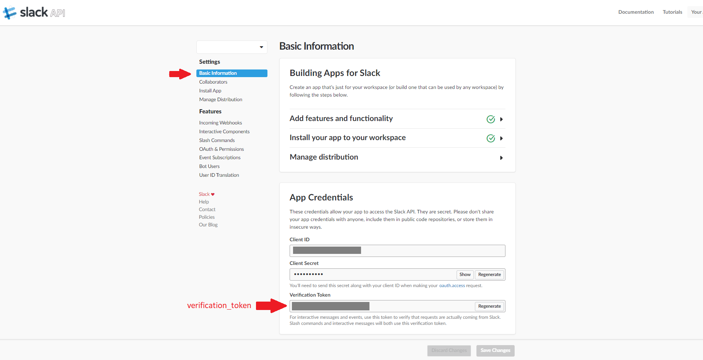
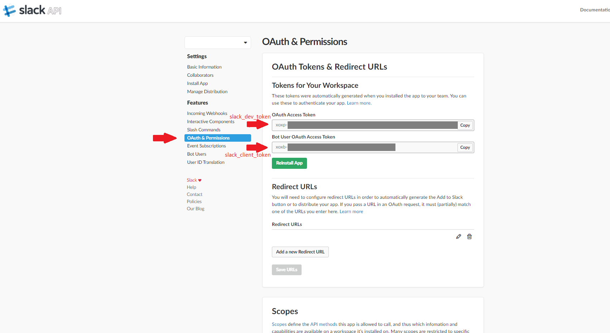
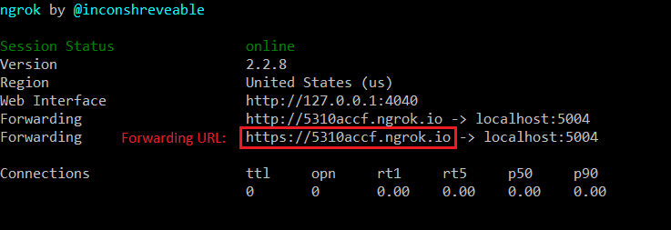
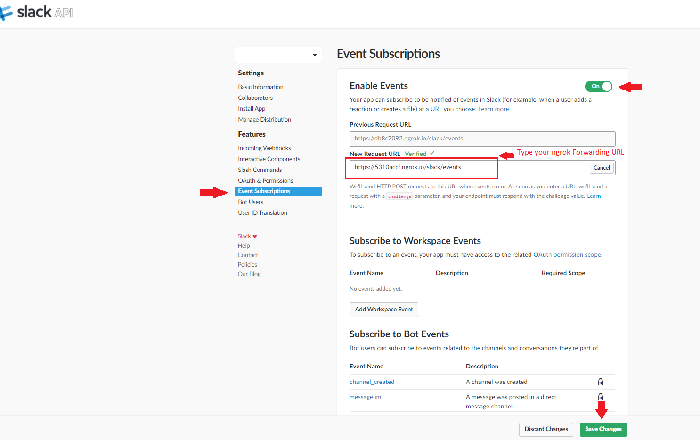

[//]: # (Image References)

[image1]: ./Pictures/requirements.png "img1"
[image2]: ./Pictures/spacy_model.png "img2"
[image3]: ./Pictures/apixu.png "img3"
[image4]: ./Pictures/npm.png "img4"

# Connecting Rasa Chatbot to Slack

This repo contains codes files which can be used to connect a chatbot, developed using Rasa stack, to Slack. The connector consists of two files, but only run_app.py file will require your modifications (you will have to load your Rasa agent and specify Slack app authentication tokens).

## Configuring a Slack app

To make use of the Slack connector you will need to have you Slack app configured. I am not going into details of how to create a bot user and integrate it into a Slack app, but if you need some guidance with this, you can check the following tutorials on https://www.fullstackpython.com/blog/build-first-slack-bot-python.html and https://api.slack.com/slack-apps. Once you have your app and bot created, you will have to find three authentication tokens of your app, which will have to be provided to Slack input channel in run_app.py file:
    
    - slack_dev_token (your app authentication token)
    - slack_client_token (your bot authentication token)
    - verification_token (a token, which will be used for interactive messages and events)
    
All these tokens can be found in your Slack app configuration page. Verification token can be found under the Basic Information tab:

  

Slack_dev_token and slack_client_token can be found under the OAuth & Permissions tab.

  

Once you find all authentication tokens, pass them to SlackInput class inside the run_app.py file. In this file, you should also load your agent, which you created using Rasa Stack. Once you do it, you are good to run the run_app.py file (it will not do much quite yet - it will load your agent and will initialise input and output channels for messages).

## Launching ngrok and starting the communication

To start the communication between your agent and your Slack app you will need ngrok (or any other multiplatform tunneling tool). Open a new terminal and launch ngrok with port 5004 (You can use another port if you like. If you do - specify your chosen port in HttpInputChannel class inside the run_app.py file and rerun it).

    ngrok http 5004 
    
Once you launch the ngrok, copy a forwarding URL (below is an example of where you should find your forwarding URL):

  

After you copy a Forwarding URL, the last thing that is left to do is to pass this URL to your Slack app so that your app would know where incoming requests should be coming from. You can do this by submitting this URL to Slack app Events Subscriptions. Make sure to add **/slack/events** at the end of your ngrok URL when submitting. Once your URL is verified don't forget to save the changes.

  

And that's it! You should be able to start talking to your chatbot :)
